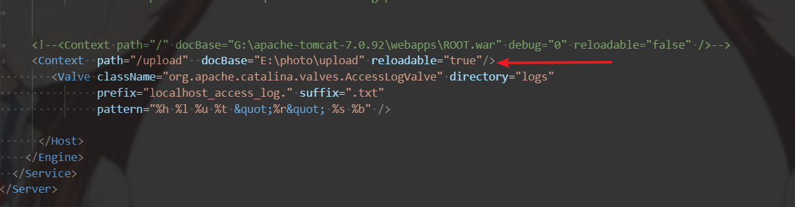

##idea设置tomcat虚拟路径的两种方法：

###1. 使用tomcat自己的虚拟路径

1. 在tomcat\config\server.xml中配置, 
    
    path="/upload" 虚拟路径, 
    
    G:\apache-tomcat-7.0.92\webapps\upload 图片存放的真实路径

<Context  path="/upload"  docBase="E:\photo\upload" reloadable="true"/></Host>

2. 将Deploy applications configured in Tomcat instance勾上

###2.用idea设置虚拟路径 

1. Deploy applications configured in Tomcat instance不要勾上

2. 设置虚拟路径

设置成功后，此文件夹的资源就可以像webapps/ROOT文件夹下访问一样了

  